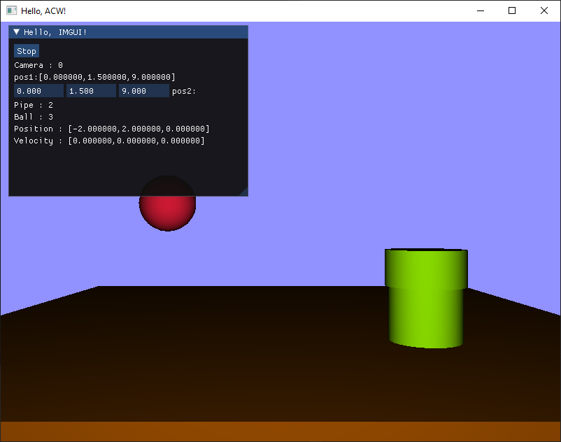
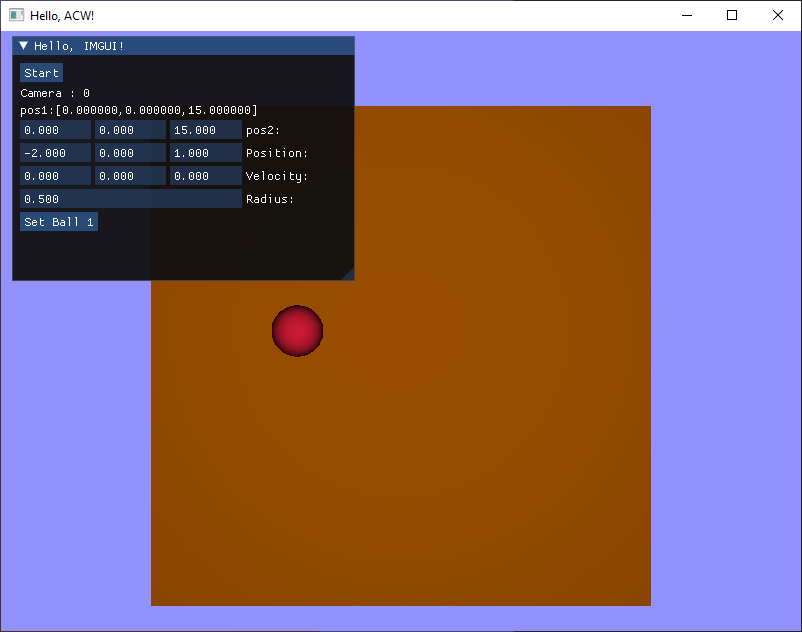
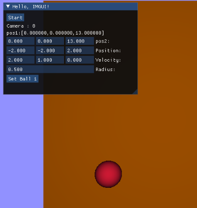
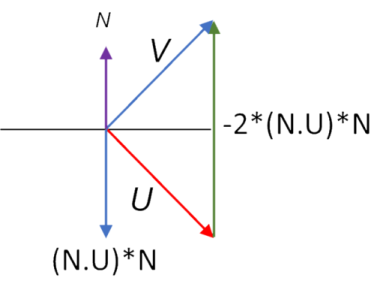
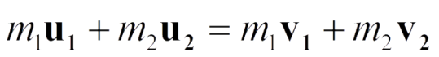
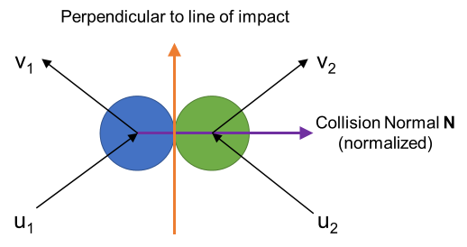
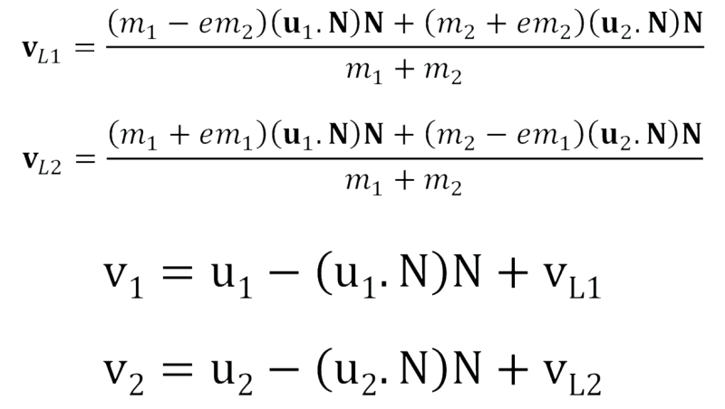

# 700110 Collision-Response

# Aim

The aim of these labs is to help you understand collision response. The labs will move from simple Euler motion, then to the relatively simple case of colliding a sphere with an axis alligned plane that is not moving to more general cases detailed below.

You will work on these labs over the next few weeks as you encounter the topics in lectures.

These labs do not cover the intersection tests to determine if a collision has happened in all cases, but does cover how to respond to that collision. Specifically, this lab covers the following tasks.

1. Elastic collision and response between a sphere and a stationary axis alligned plane.
2. Elastic collision and response between a sphere and a stationary sphere - demonstrating response between a sphere and any stationary surface.
3. Inelastic collision and response betweee a sphere and a moving sphere with a different mass - demonstrating energy loss.

# Setting up the environment

If you run the code you should see this scene (run in x86):



This is provided to give you an example of how to interact with this framework. For the rest of the labs we need a visual representation of a world where it is easy to see what is going on.

Change the values of the ground to be a 10 x 10 cube in the x-y plane (in main()).

``` cpp
    ground.Scale(glm::vec3(10.0f, 10.0f, 1.0f));
```

You will also have to change the position of the camera (line 51) and the ball (in main()), and remove the pipe altogether (comment out the lines of code that add the pipe to the renderer (in renderOpenGL()) and the UI (in renderImGui())). You should end up with something like this if you select the Stop button in the UI:



# Moving the ball

Next let's set the ball moving. To do this call the Update() method on ball1 in the main() method in App.cpp

``` cpp
// update physics 100 times a second
if (updateTime < 0)
{
    updateTime = 1.0 / 100.0f;
    ball1.Update(0.01f);
}
```

In Ball.cpp in the Update() method, translate the ball by the velocity multiplied by the timestep.

```cpp
void Ball::Update(float pDeltaTime)
{
	Translate(m_Velocity * pDeltaTime);
}
```

Finally, in order for the ball to move you need to be able to set the velocity of the ball. In Ball.h do that in the SetVelocity() method.

``` cpp
void SetVelocity(glm::vec3 pVelocity)
{
    m_Velocity = pVelocity;
}
```

Remember to set the ball to have an initial velocity. Click Stop to open the ball editing interface - setBall1 to assign the values in the UI to Ball1 and Start again to start the simulation.



# Bounce off "edges" of the world

Next, you will bounce the ball off the edges of the world. Start by adding code to bounce off the right wall. For now you can do this in the App.cpp just after you move the ball.


# Bounce off another stationary ball

Next add a second ball, ball2 to the scene. Add it to the renderOpenGL() method.

``` cpp
    ball1.Render(*renderHelper);
    ball2.Render(*renderHelper);
```

It would also be useful to replicate the controls set up in the renderImGui() method so that you are able to control ball1 in the same way that you control ball2.

To see if there is a collision between a ball and a stationary ball add the following code to the ball class. Note that later we will make the both balls move, so you might want to refactor this into a different StationaryBall class, or maybe give the Ball class a flag to indicate if it moves or not.

In order to process the collision with a stationary ball (or any stationary surface) we need to know two things - if there was a collision, and what the normal vector of the surface at the point of the collision was.

``` cpp
auto Ball::CollideWithBall(Ball& pBall) const
{
	struct returnValues {
		bool collision;
		glm::vec3 normal;
	};

	glm::vec3 v = GetPosition() - pBall.GetPosition();
	
	bool collision = false;
	glm::vec3 normal;

	if (v.length() < pBall.GetRadius() + this->GetRadius())
	{
		collision = true;
		normal = glm::normalize(v);
	}

	return returnValues{ collision, normal };
}
```

Note - performing a square root in the length() method is slow. If you are doing this a lot it is better to use the length2 (length squared) method that is part of gtx/norm.hpp and then squaring all of values if required.

# Response with any surface that does not move

In order to avoid multiple collisions the first thing we should do is move the moving ball back to a previous good position. Probably the most reliable way to do this is to cache the previous position of the ball. Create a glm::vec3 data member in ball called m_LastPosition. Then, in the update() method before the position is updated set the previous position to be the current position.

Whenever a ball hits a surface that does not move, an appropriate response is to reflect the ball's velocity with respect to the collision normal. After you've updated one ball, check for collisions with all the objects you want to collide with in your scene. If any collide, get the normal vector of the collision (this depends of the type of collision, and the collision information of the objects, etc.), and then pass that back to the ball to a method that moves the ball back to the previous good position, then reflect the velocity with respect to the normal, as shown below.



Use this maths in your CollisionResponse() method in your circle object to allow your circle to respond to any collision. To calculate the velocity after the collision V you should multiply that by the collision normal N and then add it to the initial velocity U twice.

Another way to put this would be:
**V = U - 2 * ( N.U ) * N**

To add elasticity (how much bounce you get), we need to change the value of 2.  If we replace this with e+1 then we can change the coefficient of restitution (e) to suit the response.  When e = 0, the ball will slide on the ground and when e = 1, no energy is lost.

Another way to put this would be:
**V = U - ( 1+e ) * ( N.U ) * N**

**Test your code**

To test this modification you should set up some well known scenarios. For example, if e is 1 then there should be no energy loss, and the simulation should behave as it has previously. If e is set to 0 then objects will slide and/or stick together.

# Bounce off another moving ball with different masses

The consvervation of energy tells us that there should be the same amount of momentum immediately after the impact as there is at the time of impact (see below).



Each ball has its own velocity at the time of impact (u1 and u2 in the diagram).  We need to calculate the resultant velocities after the impact (v1 and v2 in the diagram).



By comparing all of the above information, we can calculate the resultant velocities that also allow for elasticity (bounce).  We will explore this in detail in lectures.  The resultant equations are then:



**Test your code**

Again, to test this modification you should set up some well known scenarios. For example, if e is 1 then there should be no energy loss, and the simulation should behave as it has previously. If e is set to 0 then objects will slide and/or stick together.
